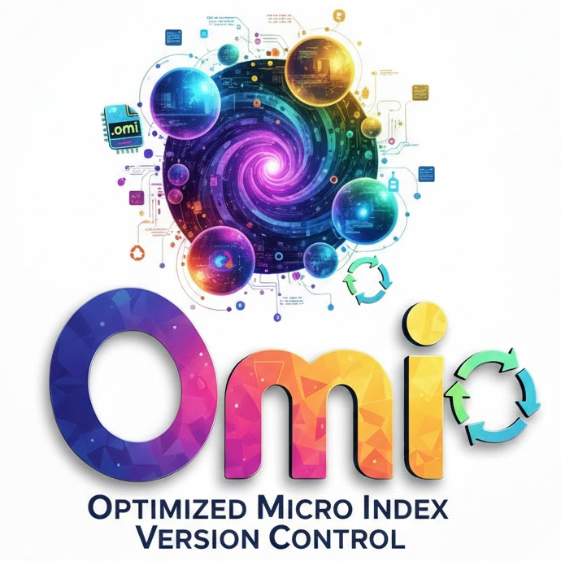
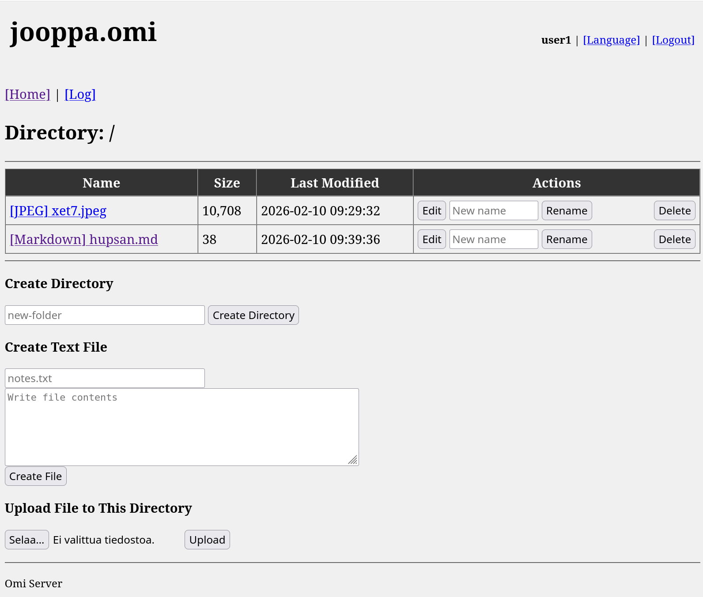

## Omi - Optimized Micro Index Version Control

**Omi** is a lightweight, cross-platform version control system that stores complete repository history in a single SQLite database file (.omi).

Difference to Fossil SCM is, that Omi stores deduplicated files to SQLite as blobs without compressing,
this simplifies implementation and porting to limited CPU resources like Amiga and FreeDOS.

## Features
- [X] Cross-platform CLI and Web UI
  - [X] File deduplication via SHA256 hashing
  - [X] SQLite-based storage
- CLI
  - [X] Git-like commands (`init`, `clone`, `add`, `commit`, `push`, `pull`)
- Web
  - [X] HTML 3.2 compatible (works with IBrowse, Dillo, Elinks, w3m)
  - [X] User account management with passwords and 2FA/TOTP
  - [X] Brute force protection and API rate limiting
  - [X] Web-based file management (upload, download, edit, delete)
  - [X] Markdown rendering and SVG viewing
  - [X] Audio/video player support

## Logo



## Web UI: HTML 3.2 compatible



### Server Platforms Supported
- PHP
- JavaScript/Node.js/Bun/Deno
- FreePascal

### URLs
- **Repo default URLs**: PHP `http://localhost:8000`, Node.js `http://localhost:8080/`, FreePascal `http://localhost:3001`
- **Sign In**: `/sign-in`
- **Create Account**: `/sign-up`
- **Browse Repo**: `/reponame`
- **Manage Users**: `/people` (login required)
- **Settings**: `/settings` (login required)

## CLI: Bash, FreeDOS .bat, AmigaShell, etc
```bash
cd omi/cli
./omi.sh init              # Initialize repository
./omi.sh add --all         # Stage files
./omi.sh commit -m "msg"   # Create commit
./omi.sh push              # Upload to server
./omi.sh pull              # Download from server
./omi.sh list              # Show available repos
```

### CLI Platforms Supported
- **AmigaShell** (Amiga systems) - [cli/omi.amigashell](cli/omi.amigashell)
- **FreeDOS** (.bat scripts) - [cli/omi.bat](cli/omi.bat)
- **Linux/Unix/macOS** (Bash) - [cli/omi.sh](cli/omi.sh)
- **Lua 5.1+** (Cross-platform scripting language) - [cli/omi.lua](cli/omi.lua)
- **Python 3.6+** (Pure Python, no dependencies) - [cli/omi.py](cli/omi.py)
- **Haxe 5.0+** (Multi-target compiled language) - [cli/omi.hx](cli/omi.hx)
- **C# / Mono** (Compiled CLI with .NET compatibility) - [cli/omi.cs](cli/omi.cs)
- **C89** (Portable C implementation for classic/modern systems) - [cli/omi.c](cli/omi.c)
- **Tcl 8.5+** (Tclsh scripting language) - [cli/omi.tcl](cli/omi.tcl)

## Documentation

**Full documentation is in the [`docs/`](docs/) directory:**

Start with **[`docs/README.md`](docs/README.md)** for navigation and quick reference.

Key guides:
- **[FEATURES.md](docs/FEATURES.md)** - Complete feature overview
- CLI:
  - **[CLI_AMIGASHELL.md](docs/CLI_AMIGASHELL.md)** - CLI for Amiga
  - **[CLI_BAT.md](docs/CLI_BAT.md)** - CLI for FreeDOS/Windows
  - **[CLI_BASH.md](docs/CLI_BASH.md)** - CLI for Linux/Unix/macOS
  - **[CLI_C89.md](docs/CLI_C89.md)** - CLI for C89 (portable C implementation)
  - **[CLI_CSHARP.md](docs/CLI_CSHARP.md)** - CLI for C# / Mono (compiled, .NET)
  - **[CLI_HAXE5.md](docs/CLI_HAXE5.md)** - CLI for Haxe 5 (compiled, multi-target)
  - **[CLI_LUA.md](docs/CLI_LUA.md)** - CLI for Lua (cross-platform)
  - **[CLI_PYTHON3.md](docs/CLI_PYTHON3.md)** - CLI for Python 3 (recommended)
  - **[CLI_TCL.md](docs/CLI_TCL.md)** - CLI for Tcl (tclsh)
- **[WEB.md](docs/WEB.md)** - Web interface guide
- SERVER:
  - **[SERVER_FREEPASCAL.md](docs/SERVER_FREEPASCAL.md)** - FreePascal server (compiled binary)
  - **[SERVER_JS.md](docs/SERVER_JS.md)** - JavaScript server (Node.js, Bun, Deno)
  - **[SERVER_PHP.md](docs/SERVER_PHP.md)** - PHP server setup
- **[DATABASE_SCHEMA.md](docs/DATABASE_SCHEMA.md)** - Database design

## Setup

Choose your server implementation:

- **FreePascal** (recommended for retro systems): Single compiled binary, minimal dependencies  
  See **[`docs/SERVER_FREEPASCAL.md`](docs/SERVER_FREEPASCAL.md)** for setup

- **JavaScript** (Node.js, Bun, or Deno): Multi-runtime support  
  See **[`docs/SERVER_JS.md`](docs/SERVER_JS.md)** for setup

- **PHP** (Apache, Nginx, or Caddy): Traditional web server deployment  
  See **[`docs/SERVER_PHP.md`](docs/SERVER_PHP.md)** for setup

Configure `settings.txt` and `users.txt` as needed.

Webserver configs are at `docs/webserver/`

## Build Scripts
Use the build menu scripts in the `cli/` directory to compile/transpile Omi to multiple targets. Each script writes outputs to `cli/build/<target>/`.

- **[cli/build.sh](cli/build.sh)** - Unix/Linux/macOS build menu
- **[cli/build.bat](cli/build.bat)** - Windows CMD build menu
- **[cli/build.amigashell](cli/build.amigashell)** - AmigaShell build menu
- **[cli/build.lua](cli/build.lua)** - Lua build menu
- **[cli/build.py](cli/build.py)** - Python3 build menu

Examples:

```bash
cd cli
./build.sh
python3 build.py
lua build.lua
```

## Related Projects

- [Fossil SCM](https://fossil-scm.org/) - Original DVCS with SQLite
- [WeDOS](https://github.com/wekan/wedos) - Kanban board (FreeDOS + Bash)
