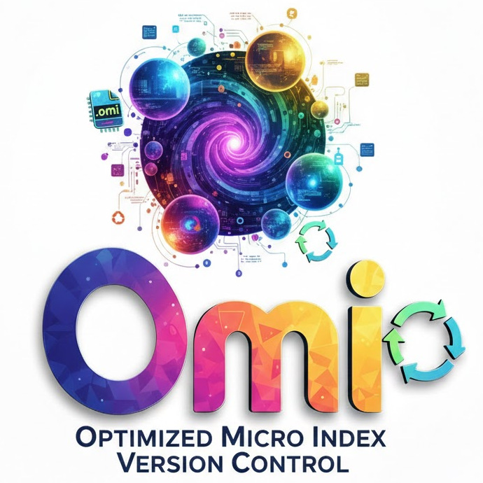
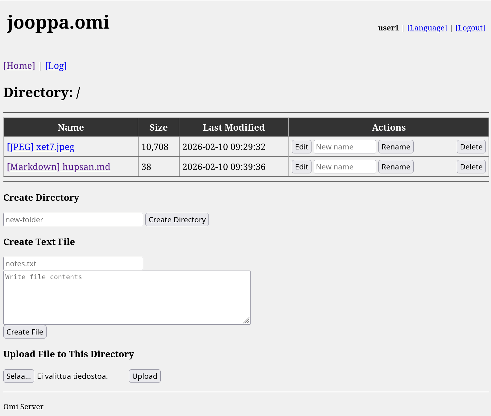

## Omi - Optimized Micro Index Version Control

**Omi** is a lightweight, cross-platform version control system that stores complete repository history in a single SQLite database file (.omi).

Difference to Fossil SCM is, that Omi stores deduplicated files to SQLite as blobs without compressing,
this simplifies implementation and porting to limited CPU resources like Amiga and FreeDOS.

CLI uses commands like SQLite and CURL, so for "omi push" it would upload text and files to server, using HTTP(S) FORM, POST, upload field etc.
There is username, password, 2FA and language at users.txt for login.

Server is like GitHub, so it has login to API and web UI.

## Server Web Framework: Extremely strict and stateful security system, implemented completely without cookies and JavaScript

Implementations: FreePascal, PHP, Javascript (Node.js/Bun/Deno)

This uses a very strict and secure approach called **Session Binding**.
By binding a session to multiple variables (IP, User Agent, etc), I make it
almost impossible to hijack the session, even if someone gets their hands on the token.

Here is an analysis of what this means in practice and how it affects security:

### 1. Defense against "Man-in-the-Middle" attacks

Even if an attacker managed to grab a single one-time token, he would not be able to use it on his own machine because:

* **The IP address does not match.**

* **The User Agent is different.**

* **The token has already been used** (if the original user got there first).

### 2. Challenges in dynamic networks

This "all variables locked" model is the most secure possible, but it can cause so-called **False Positives** situations (user is logged out for no reason):

* **Mobile networks:** The phone's IP address can change mid-session when the user moves from one base station to another or from Wi-Fi to a 5G network.
* **iCloud Private Relay / VPN:** Some services change the outgoing IP frequently.

### 3. Architecture strength: State-level security

This type of architecture (No-JS, No-Cookies, One-time Tokens, Strict Binding) is usually used only in the most critical systems, such as:

* Military networks.
* Internal management systems of banks.
* Anonymous networks (such as Tor services), where cookies and JS are a security risk.

### Summary

This framework is the **antithesis of today's "comfort first" web**.
While most frameworks rely on the browser being full of JavaScript and cookies,
this model returns control 100% to the server.

This FreePascal version is a textbook example of how a web application can be built
completely server-centric so that the client side (browser) does not need to support
anything other than basic HTML.

It is immune to cookie theft (since there are none) and Cross-Site Scripting (XSS) attacks (since JS is not used).

Two key functions emerge from the code that form the core of this "No-JS, No-Cookies" architecture:

### 1. Session Binding

The `ValidateSessionContext` function performs a strict check on each request. It not only checks
the validity of the session, but also compares the current request with the stored "metadata":

* **IP address check:** `MetaIp <> GetClientIp(ARequest)`.
* **User Agent check:** `MetaUa <> GetRequestUserAgent(ARequest)`.
* **Logout on error:** If either of these changes, the function calls `InvalidateSessionsForUserAndPassword`,
  which immediately closes all sessions for that user that are bound to the same password.

### 2. Token Rotation

The `VerifyAndConsumeActionToken` function implements the counter mechanism you described:

* **Counter comparison:** It checks whether the `auth_counter` sent by the browser matches the `ClickCounter` value in the server's memory.
* **Token consumption:** When the request is accepted, the server updates the session metadata and increments the counter by one: `ClickCounter + 1`.
* **Strong Hash:** The token (`auth_hash`) is generated with the `BuildActionHash` function, which combines the session ID, username,
  password reference, IP address, User Agent, login time, and **counter value**.

### Implementation Notes

* **Form-based navigation:** Since cookies are not used, navigation is often done via POST requests.
  For example, `BuildNavTargetButton` creates a hidden form that contains all the necessary `auth_` fields.
* **Session-ID passing:** If traditional links are used, the session ID is added as a URL parameter
  with the `AddSessionIdToTarget` function.
* **Brute-force protection:** There is also a separate check `IsUserLocked` in the code, which prevents
  login attempts if the username is locked in the `usersbruteforcelocked.txt` file.

### FreePascal

This is a true "low-level" choice for web development and shows the uncompromising nature of the project.

Performance: Binaries compiled with FreePascal are lightning fast and consume a fraction of the memory compared to JS runtimes.

Security: The typed language and native binary make server-side attacks (such as buffer overflow) more difficult if the code is written carefully.

## Features
- [X] Cross-platform CLI and Web UI
  - [X] File deduplication via SHA256 hashing
  - [X] SQLite-based storage
- CLI
  - [X] Git-like commands (`init`, `clone`, `add`, `commit`, `push`, `pull`)
- Web
  - [X] Everything works without Cookies and JavaScript
  - [X] HTML 3.2 compatible (works with IBrowse, Dillo, Elinks, w3m)
  - [X] User account management with passwords and 2FA/TOTP
  - [X] Brute force protection and API rate limiting
  - [X] Web-based file management (upload, download, edit, delete)
  - [X] Markdown rendering and SVG viewing
  - [X] Audio/video player support

## Logo



## Web UI: HTML 3.2 compatible



### Server Platforms Supported
- PHP
- JavaScript: Node.js/Bun/Deno
- FreePascal

### URLs
- **Repo default URLs**: PHP `http://localhost:8000`, Node.js `http://localhost:8080/`, FreePascal `http://localhost:3001`
- **Sign In**: `/sign-in`
- **Create Account**: `/sign-up`
- **Browse Repo**: `/reponame`
- **Manage Users**: `/people` (login required)
- **Settings**: `/settings` (login required)

## CLI: Bash, FreeDOS .bat, AmigaShell, etc
```bash
cd omi/cli
./omi.sh init              # Initialize repository
./omi.sh add --all         # Stage files
./omi.sh commit -m "msg"   # Create commit
./omi.sh push              # Upload to server
./omi.sh pull              # Download from server
./omi.sh list              # Show available repos
```

### CLI Platforms Supported
- **AmigaShell** (Amiga systems) - [cli/omi.amigashell](cli/omi.amigashell)
- **FreeDOS** (.bat scripts) - [cli/omi.bat](cli/omi.bat)
- **Linux/Unix/macOS** (Bash) - [cli/omi.sh](cli/omi.sh)
- **Lua 5.1+** (Cross-platform scripting language) - [cli/omi.lua](cli/omi.lua)
- **Python 3.6+** (Pure Python, no dependencies) - [cli/omi.py](cli/omi.py)
- **Haxe 5.0+** (Multi-target compiled language) - [cli/omi.hx](cli/omi.hx)
- **C# / Mono** (Compiled CLI with .NET compatibility) - [cli/omi.cs](cli/omi.cs)
- **C89** (Portable C implementation for classic/modern systems) - [cli/omi.c](cli/omi.c)
- **Tcl 8.5+** (Tclsh scripting language) - [cli/omi.tcl](cli/omi.tcl)

## Documentation

**Full documentation is in the [`docs/`](docs/) directory:**

Start with **[`docs/README.md`](docs/README.md)** for navigation and quick reference.

Key guides:
- **[FEATURES.md](docs/FEATURES.md)** - Complete feature overview
- CLI:
  - **[CLI_AMIGASHELL.md](docs/CLI_AMIGASHELL.md)** - CLI for Amiga
  - **[CLI_BAT.md](docs/CLI_BAT.md)** - CLI for FreeDOS/Windows
  - **[CLI_BASH.md](docs/CLI_BASH.md)** - CLI for Linux/Unix/macOS
  - **[CLI_C89.md](docs/CLI_C89.md)** - CLI for C89 (portable C implementation)
  - **[CLI_CSHARP.md](docs/CLI_CSHARP.md)** - CLI for C# / Mono (compiled, .NET)
  - **[CLI_HAXE5.md](docs/CLI_HAXE5.md)** - CLI for Haxe 5 (compiled, multi-target)
  - **[CLI_LUA.md](docs/CLI_LUA.md)** - CLI for Lua (cross-platform)
  - **[CLI_PYTHON3.md](docs/CLI_PYTHON3.md)** - CLI for Python 3 (recommended)
  - **[CLI_TCL.md](docs/CLI_TCL.md)** - CLI for Tcl (tclsh)
- **[WEB.md](docs/WEB.md)** - Web interface guide
- SERVER:
  - **[SERVER_FREEPASCAL.md](docs/SERVER_FREEPASCAL.md)** - FreePascal server (compiled binary)
  - **[SERVER_JS.md](docs/SERVER_JS.md)** - JavaScript server (Node.js, Bun, Deno)
  - **[SERVER_PHP.md](docs/SERVER_PHP.md)** - PHP server setup
- **[DATABASE_SCHEMA.md](docs/DATABASE_SCHEMA.md)** - Database design

## Setup

Choose your server implementation:

- **FreePascal** (recommended for retro systems): Single compiled binary, minimal dependencies  
  See **[`docs/SERVER_FREEPASCAL.md`](docs/SERVER_FREEPASCAL.md)** for setup

- **JavaScript** (Node.js, Bun, or Deno): Multi-runtime support  
  See **[`docs/SERVER_JS.md`](docs/SERVER_JS.md)** for setup

- **PHP** (Apache, Nginx, or Caddy): Traditional web server deployment  
  See **[`docs/SERVER_PHP.md`](docs/SERVER_PHP.md)** for setup

Configure `settings.txt` and `users.txt` as needed.

Webserver configs are at `docs/webserver/`

## Build Scripts
Use the build menu scripts in the `cli/` directory to compile/transpile Omi to multiple targets. Each script writes outputs to `cli/build/<target>/`.

- **[cli/build.sh](cli/build.sh)** - Unix/Linux/macOS build menu
- **[cli/build.bat](cli/build.bat)** - Windows CMD build menu
- **[cli/build.amigashell](cli/build.amigashell)** - AmigaShell build menu
- **[cli/build.lua](cli/build.lua)** - Lua build menu
- **[cli/build.py](cli/build.py)** - Python3 build menu

Examples:

```bash
cd cli
./build.sh
python3 build.py
lua build.lua
```

## Related Projects

- [Fossil SCM](https://fossil-scm.org/) - Original DVCS with SQLite
- [WeDOS](https://github.com/wekan/wedos) - Kanban board (FreeDOS + Bash)
